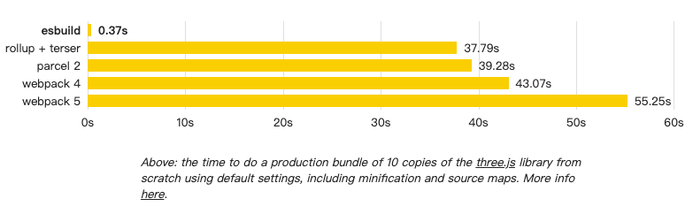
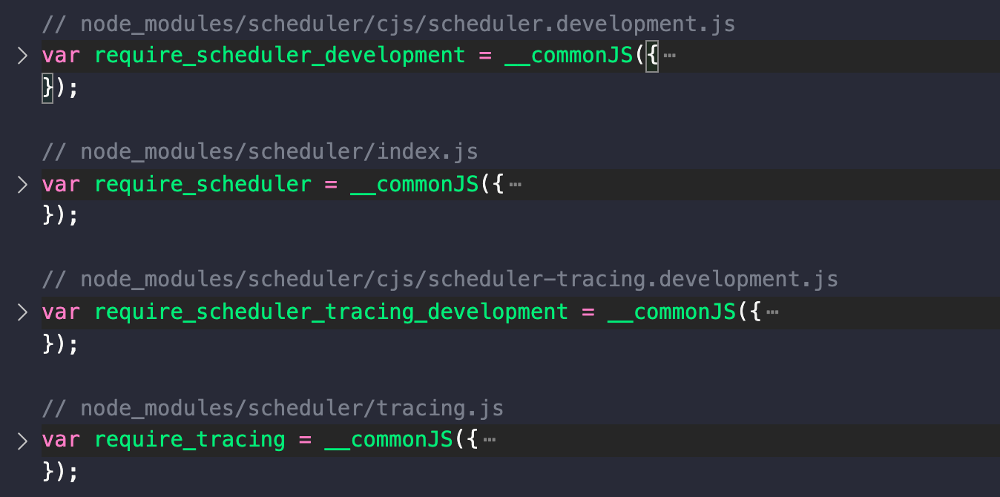

# 预构建

预构建有两个原因，这个Vite文档里也有[详细说明](https://cn.vitejs.dev/guide/dep-pre-bundling.html#the-why)。简单说，一是因为dev阶段Vite默认所有模块都为ES模块，因此需要对CJS和UMD的模块进行转换统一为ESM，二是因为很多ESM模块内部会相互导入，为了避免同时大量请求，统一为一个模块。

Vite1采用[@rollup/plugin-commonjs](https://github.com/rollup/plugins/tree/master/packages/commonjs)来进行cjs->esm的转换，Vite2改为采用[esbuild](https://esbuild.github.io/api/)来进行run server前的预构建，无论是速度还是灵活性都有很大提升。

esbuild由`go`开发，经测试速度比是其它构建工具快10-100倍，现在前端工程化领域的生态也是越发丰富多彩，比如也有用`rust`开发的[swc](https://swc.rs/)等等...



## esbuild插件
先简单介绍下esbuild的[插件机制](https://esbuild.github.io/plugins/#using-plugins)，后面的[esbuildScanPlugin](#esbuildScanPlugin)和[esbuildDepPlugin](#esbuildDepPlugin)都会用到。
esbuild插件需要返回一个对象，其中包含`name`和`setup`等属性，`name`表示该插件名，`setup`是一个函数，会传入一个参数`build`。
`build`上提供了两个hook，`onResolve`会在解析时匹配到模块的导入路径匹配时执行，可以用来改变路径、设置`external`跳过构建；`onLoad`会在加载文件时触发，可以用来改变其解析的内容和loader。
```js
//define
let envPlugin = {
  name: 'env',
  setup(build) {
    build.onResolve({ filter: /^env$/ }, args => ({//匹配env，指定namespace为env-us
      path: args.path,
      namespace: 'env-ns',
    }))
    build.onLoad({ filter: /.*/, namespace: 'env-ns' }, () => ({//匹配env-us的namespace
      contents: JSON.stringify(process.env),
      loader: 'json',
    }))
  },
}
require('esbuild').build({
  entryPoints: ['app.js'],
  bundle: true,
  outfile: 'out.js',
  plugins: [envPlugin],
}).catch(() => process.exit(1))
//use
import { PATH } from 'env'
console.log(`PATH is ${PATH}`)
```
这是官方文档里的一个例子，在`onResolve`阶段匹配到`env`，指定其`namespace`为env-ns，在`onload`阶段根据env-ns的`namespace`匹配到，返回process.env交由json loader处理，这样在构建后的代码里从`env`拿到了最新的环境变量`process.env`。


## 劫持listen
Vite劫持了httpserver默认的listen，因此在监听端口前先执行预构建
```javascript
// packages/vite/src/node/server/index.ts
const listen = httpServer.listen.bind(httpServer)
httpServer.listen = (async (port: number, ...args: any[]) => {
  try {
    await container.buildStart({}) 
    await runOptimize()
  } catch (e) {
    httpServer.emit('error', e)
    return
  }
  return listen(port, ...args)
}) as any
```

`container`是贯穿整个流程的插件系统，`buildstart`会触发所有插件的`buildStart`hook，关于[插件系统](./pluginContainer.md)我们后面会专项研究，在`runOptimize`里执行了预构建相关操作。


## 寻找入口
入口会通过[optimizeDeps?.entries](https://cn.vitejs.dev/config/#optimizedeps-entries) -> [build.rollupOptions?.input](https://cn.vitejs.dev/guide/backend-integration.html#backend-integration) -> html这样的优先级寻找，默认情况是根目录的index.html

## 自动依赖搜寻
确定入口后，`scanImports`通过[Build API](https://esbuild.github.io/api/#build-api)结合自定义插件`esbuildScanPlugin`，从入口开始寻找引入的依赖项。
```typescript
const plugin = esbuildScanPlugin(config, container, deps, missing, entries)
await Promise.all(
  entries.map((entry) =>
    build({
      write: false,
      entryPoints: [entry],
      bundle: true,
      format: 'esm',
      logLevel: 'error',
      plugins: [...plugins, plugin],
      ...esbuildOptions
    })
  )
)
```
`entryPoints`为确认的入口，例如`["/Users/admin/Desktop/vue-ts/index.html"]`这样，esbuild从入口开始，搜寻依赖。
`write`为false表示不会将构建结果写入磁盘，而是写入到内存，这里在`esbuildScanPlugin插件`中进行处理。

### esbuildScanPlugin
依赖搜寻的逻辑集中在`esbuildScanPlugin`，主要进行了如下处理：
1. 对于css、json、静态资源、网络请求等其它不需要预构建的资源，`onResolve`匹配到后指定`external`为true跳过
2. 对于html、vue、svelte这些`HTML-like files`(包含script脚本)的文件，匹配到后返回[resolved](./resolved.md)路径并指定`namespace`为`html`
```ts
  build.onResolve({ filter: htmlTypesRE }, async ({ path, importer }) => {
    return {
      path: await resolve(path, importer),
      namespace: 'html'
    }
  })
```
  &emsp;&emsp;这些文件在`onload`阶段会再通过`filter`、和`html namespace`匹配到处理，这段代码比较长，涉及到非常多的正则匹配，概括来说主要以下三点：
  + 对于html文件，分离出其中的module script，例如`<script type="module" src="/src/main.ts"></script>`会被分离为`import "/src/main.ts"  export default {} `交给js loader
  + 对于vue和svelte文件，分离script内容，取决于lang交给ts或js loader
  + 如果分离的代码里没有`export default`，会手动补上`export default {}`

3. 匹配所有`bare imports`，根据其bare name和`importer`寻找[resolved](./resolved.md)后的路径，如果有记录在结果`deps`里返回，比如`lodash-es`的路径就是`/Users/admin/Desktop/vue-ts/node_modules/lodash-es/lodash.js`，如果没有则记录在`missing`里返回，Vite会抛出异常，导致预构建失败
4. 此外，还会进行`import.meta.glob`等其它情况的处理

最终搜寻出的依赖项将作为预构建的入口点，返回例如以下所示的依赖项
```
{
  react: '/Users/admin/Desktop/vite-react-ts/node_modules/react/index.js',
  'react-dom': '/Users/admin/Desktop/vite-react-ts/node_modules/react-dom/index.js',
  'lodash-es': '/Users/admin/Desktop/vite-react-ts/node_modules/lodash-es/lodash.js'
} 
```

## build esm

拿到所有依赖项后，开始构建，同[自动依赖搜寻](#自动依赖搜寻)一样，也是`build API`和自定义插件`esbuildDepPlugin`结合
```typescript
const result = await build({
  entryPoints: Object.keys(flatIdDeps),
  bundle: true,
  format: 'esm',
  external: config.optimizeDeps?.exclude,
  logLevel: 'error',
  splitting: true,
  sourcemap: true,
  outdir: cacheDir,
  treeShaking: 'ignore-annotations',
  metafile: true,
  define,
  plugins: [
    ...plugins,
    esbuildDepPlugin(flatIdDeps, flatIdToExports, config)
  ],
  ...esbuildOptions
})
```

`entryPoints`指以上面搜寻的依赖项为入口，例如`['lodash-es','vue']`

这里指定`bundle`为true,会递归将依赖的依赖也内联到单文件中。举个例子，react-dom里引用了scheduler这个外部依赖，那么在构建出的react-dom.js里，包含了scheduler的模块.

构建出的`esm`bundle会写入到`cacheDir`中，`cacheDir`默认为`your_project/node_modules/.vite`

`external`表示哪些模块将不会被bundle，可以在config中配置，这块可以用来规排除不会执行的代码或不会在当前环境执行的代码，比如某块代码只能在node中执行而不能在浏览器中执行。

`define`用来在构建时注入替换的全局变量，比如`process.env.NODE_ENV`，这些变量在开发环境下会被定义在全局，而在构建时被静态替换。

除了每个依赖被打包成单esm bundle，最终打包的产物中，会有一个公用chunk里定义了`__commonJS`方法，例如`react`、`react-dom`等cjs模块会用这个方法处理，而`lodash-es`等esm模块则不需要
```javascript
var __commonJS = (cb, mod) => function __require() {
  return mod || (0, cb[Object.keys(cb)[0]])((mod = {exports: {}}).exports, mod), mod.exports;
};
```

### esbuildDepPlugin
这里集中了build的主要逻辑,WIP
## 缓存
在构建完成后，会写入`_metadata.json`到cache目录，内容主要包括`hash`、`browserHash`、`optimized`三个部分。
- `hash`由`config`和`依赖的lock`而来，每次预构建前都会比较`hash`以判断是否需要跳过
- `browserHash`由`hash`和搜寻依赖而来，在浏览器请求已优化的依赖时会用到
- `optimized`主要包含了已构建依赖的src、output地址以及`needsInterop`，其表示是否需要作为非esm模块额外处理，在处理浏览器请求时也会用到
