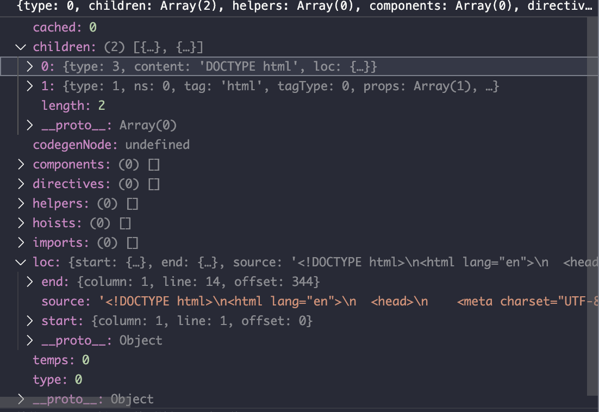

# HTML
Vite2以原生`http server`的方式启动服务，结合[connect](https://www.npmjs.com/package/connect)以plugins方式注册中间件。在服务启动前，注册了`indexHtmlMiddleWare`中间件。
```ts
const middlewares = connect() as Connect.Server
const httpServer = middlewareMode ? null: await resolveHttpServer(serverConfig, middlewares, httpsOptions)
middlewares.use(indexHtmlMiddleware(server))
```

<br>


```ts
export function indexHtmlMiddleware(
  server: ViteDevServer
): Connect.NextHandleFunction {
  return async function viteIndexHtmlMiddleware(req, res, next) {
    const url = req.url && cleanUrl(req.url)
    if (url?.endsWith('.html') && req.headers['sec-fetch-dest'] !== 'script') {
      const filename = getHtmlFilename(url, server)
      if (fs.existsSync(filename)) {
        try {
          let html = fs.readFileSync(filename, 'utf-8')
          html = await server.transformIndexHtml(url, html, req.originalUrl)
          return send(req, res, html, 'html')
        } catch (e) {
          return next(e)
        }
      }
    }
    next()
  }
}
```
`indexHtmlMiddleware`作为中间件匹配html请求，根据读取出html内容返回转义后的html


```ts
export async function traverseHtml(
  html: string,
  filePath: string,
  visitor: NodeTransform
): Promise<void> {
  const { parse, transform } = await import('@vue/compiler-dom')
  // @vue/compiler-core doesn't like lowercase doctypes
  html = html.replace(/<!doctype\s/i, '<!DOCTYPE ')
  const ast = parse(html, { comments: true })
  transform(ast, {
    nodeTransforms: [visitor]
  })
}
```
`traverseHtml`中，引用`'@vue/compiler-dom'`的`parse`解析html ast，ast例如下图所示。`visitor`函数中定义了ast节点的转换规则，`transform`最终会应用这些规则


```ts
const devHtmlHook: IndexHtmlTransformHook = async (
  html,
  { path: htmlPath, server, originalUrl }
) => {
  const config = server?.config!
  const base = config.base || '/'

  const s = new MagicString(html)
  let scriptModuleIndex = -1

  await traverseHtml(html, htmlPath, (node) => {
    if (node.type !== NodeTypes.ELEMENT) {
      return
    }

    // script tags
    if (node.tag === 'script') {
      const { src, isModule } = getScriptInfo(node)
      if (isModule) {
        scriptModuleIndex++
      }

      if (src) {
        processNodeUrl(src, s, config, htmlPath, originalUrl)
      } else if (isModule) {
        // inline js module. convert to src="proxy"
        s.overwrite(
          node.loc.start.offset,
          node.loc.end.offset,
          `<script type="module" src="${
            config.base + htmlPath.slice(1)
          }?html-proxy&index=${scriptModuleIndex}.js"></script>`
        )
      }
    }
    // elements with [href/src] attrs
    const assetAttrs = assetAttrsConfig[node.tag]
    if (assetAttrs) {
      for (const p of node.props) {
        if (
          p.type === NodeTypes.ATTRIBUTE &&
          p.value &&
          assetAttrs.includes(p.name)
        ) {
          processNodeUrl(p, s, config, htmlPath, originalUrl)
        }
      }
    }
  })
  html = s.toString()
  return {
    html,
    tags: [
      {
        tag: 'script',
        attrs: {
          type: 'module',
          src: path.posix.join(base, CLIENT_PUBLIC_PATH)
        },
        injectTo: 'head-prepend'
      }
    ]
  }
}
```
`devHtmlHook`里通过[magic-string]()操作ast，从根结点开始，逐层级遍历。对于script标签， 。。。对于有href/src属性的标签，会修改url